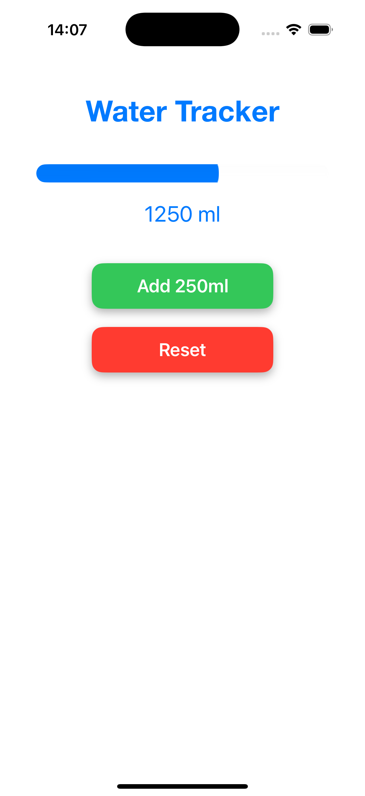

# 💧 WaterReminder

WaterReminder is an iOS application that helps users stay hydrated by sending regular reminders to drink water, tracking daily intake, and visualizing hydration progress.

## 📱 Features

- Customizable daily water intake goals
- Reminder notifications with flexible intervals
- Beautiful progress tracking interface
- History of water consumption
- Dark mode support
- Local storage using CoreData

## 🖼️ Screenshots

## 🔧 Technologies Used

- UIKit & Swift
- CoreData for persistence
- UserNotifications framework
- Auto Layout for responsive UI

## 🚀 Getting Started
